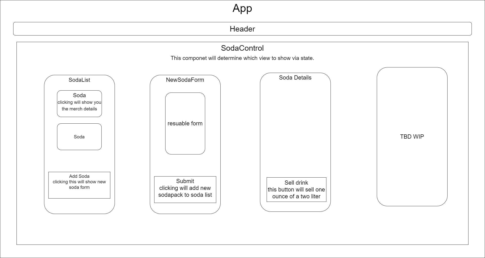

# Inventory Tracking in React

## By Maxwell Alvord

### This React program utilizes JavaScript to manipulate state as well as properties to be able to keep track of inventory.

 

## Technologies Used

---
## Inventory site Diagram   

---

### Description
This is a program built on React that allows the users to add 24 racks of soda to the party (AKA soda list). After adding soda, soda can be sold and the quantity of cans remaining will de-increment by one until you have no soda left!

## Setup/Installation
* Clone this Repo : <https://github.com/maxwellalvord/Inventory-Tracker-React>
* cd into inv-tracker

In the project directory (inv-tracker), you can run:

### `npm start`

Runs the app in the development mode.\
Open [http://localhost:3000](http://localhost:3000) to view it in your browser.

### `npm run build`

Builds the app for production to the `build` folder.\
It correctly bundles React in production mode and optimizes the build for the best performance.

The build is minified and the filenames include the hashes.\
Your app is ready to be deployed!

### `npm run eject`

**Note: this is a one-way operation. Once you `eject`, you can't go back!**

If you aren't satisfied with the build tool and configuration choices, you can `eject` at any time. This command will remove the single build dependency from your project.

Instead, it will copy all the configuration files and the transitive dependencies (webpack, Babel, ESLint, etc) right into your project so you have full control over them. All of the commands except `eject` will still work, but they will point to the copied scripts so you can tweak them. At this point you're on your own.

You don't have to ever use `eject`. The curated feature set is suitable for small and middle deployments, and you shouldn't feel obligated to use this feature. However we understand that this tool wouldn't be useful if you couldn't customize it when you are ready for it.

## Known Bugs

* If user doesn't cd into "Desktop", witha capital D, an error will appear after every refresh. Does not break program but is annoying.
* Background image repeats depending on display size.

## License
[MIT](https://opensource.org/osd)

Copyright &copy;
2022 Maxwell Alvord

Permission is hereby granted, free of charge, to any person obtaining a copy of this software and associated documentation files (the "Software"), to deal in the Software without restriction, including without limitation the rights to use, copy, modify, merge, publish, distribute, sublicense, and/or sell copies of the Software, and to permit persons to whom the Software is furnished to do so, subject to the following conditions:

The above copyright notice and this permission notice shall be included in all copies or substantial portions of the Software.

THE SOFTWARE IS PROVIDED "AS IS", WITHOUT WARRANTY OF ANY KIND, EXPRESS OR IMPLIED, INCLUDING BUT NOT LIMITED TO THE WARRANTIES OF MERCHANTABILITY, FITNESS FOR A PARTICULAR PURPOSE AND NONINFRINGEMENT. IN NO EVENT SHALL THE AUTHORS OR COPYRIGHT HOLDERS BE LIABLE FOR ANY CLAIM, DAMAGES OR OTHER LIABILITY, WHETHER IN AN ACTION OF CONTRACT, TORT OR OTHERWISE, ARISING FROM, OUT OF OR IN CONNECTION WITH THE SOFTWARE OR THE USE OR OTHER DEALINGS IN THE SOFTWARE.

 

## Contact Information
Contact me with questions and bugs at:  
[A link to my issues page on GitHub](https://github.com/maxwellalvord/maxwellalvord/issues) 
or email me at <a href = "mailto:maxwellalvord@gmail.com">maxwellalvord@gmail.com</a>